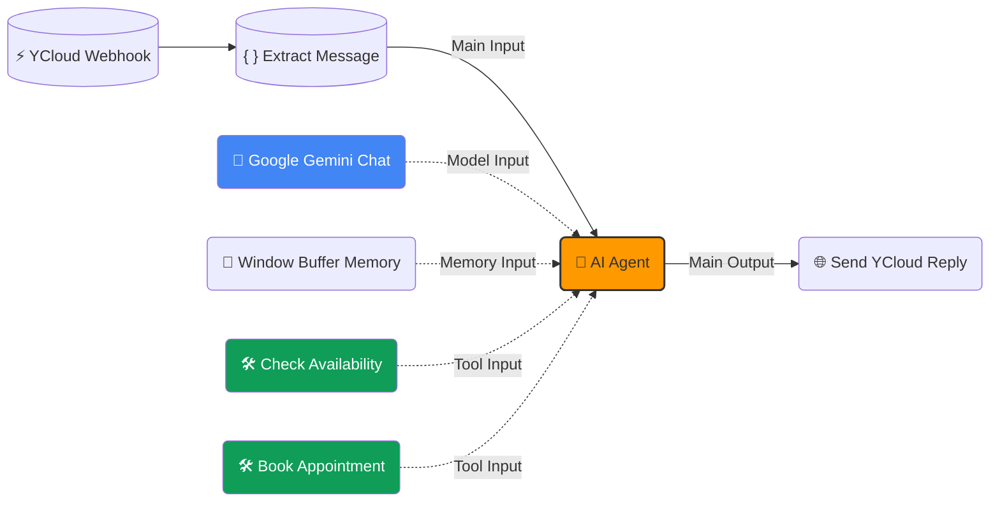

# Guía Visual de Conexiones n8n

Para que el Agente de IA funcione, tenés que conectar los "cables" de esta manera exacta.

## Instrucciones Paso a Paso

1.  **Flujo Principal (Línea Continua):**
    *   El mensaje entra por el Webhook, pasa por Extract, entra al Agente y sale hacia "Send Reply". Esto es lo normal.

2.  **Las Entradas Especiales del AI Agent (Líneas Punteadas):**
    *   El nodo **AI Agent** tiene 3 entradas especiales (a veces hay que hacer zoom para ver los puntitos grises en el borde izquierdo o inferior del nodo).
    *   **Model**: Arrastrá desde el puntito gris de **Gemini** hasta la entrada "Model" del Agente.
    *   **Memory**: Arrastrá desde **Window Buffer** hasta la entrada "Memory".
    *   **Tool**: Arrastrá desde **Check Availability** hasta la entrada "Tool".
    *   **Tool (2)**: Arrastrá también desde **Book Appointment** hasta la misma entrada "Tool" (se pueden conectar varios a la misma entrada).
